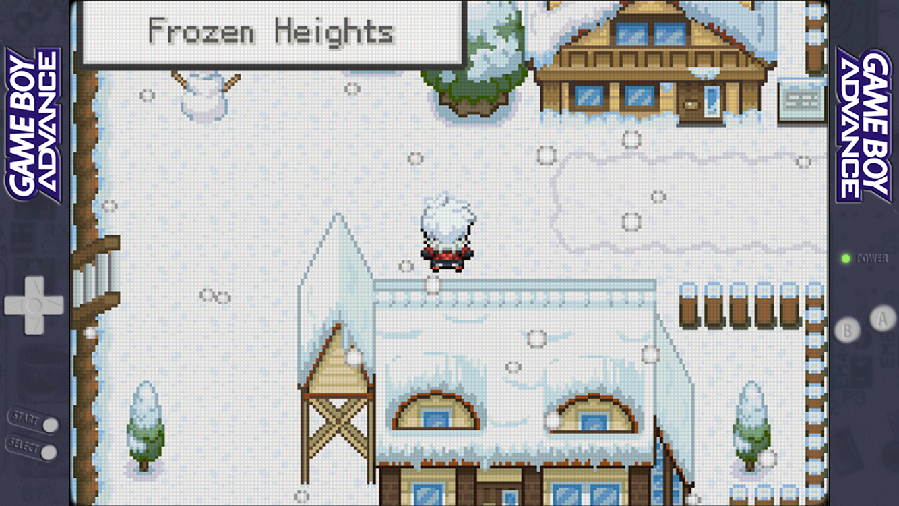

# Lo-Fi Overlays
Lo-Fi, unobtrusive overlays for 16:9 retro gaming handhelds such as Retroid Pocket 4/Retroid Pocket 4 Pro. For use with RetroArch.  
  
Attributions: [Jeltr0n](https://github.com/Jeltr0n/Retro-Overlays), [cizia64](https://github.com/cizia64/CrossMix-OS)  

Apply using RetroArch Quick Menu -> On-Screen Overlay. Set Overlay Opacity to 1.00  

## 16:9, 1334x750 resolution (Retroid Pocket 4/Pro) ##
### Game Boy Advance (GBA) ###
#### Default ####

#### Dark ####

#### Transparent Purple (See-through PCB) ####

