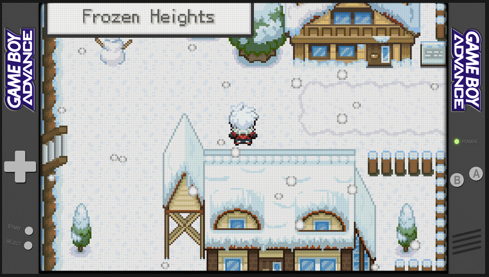
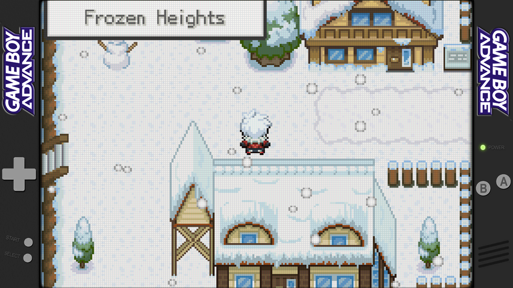
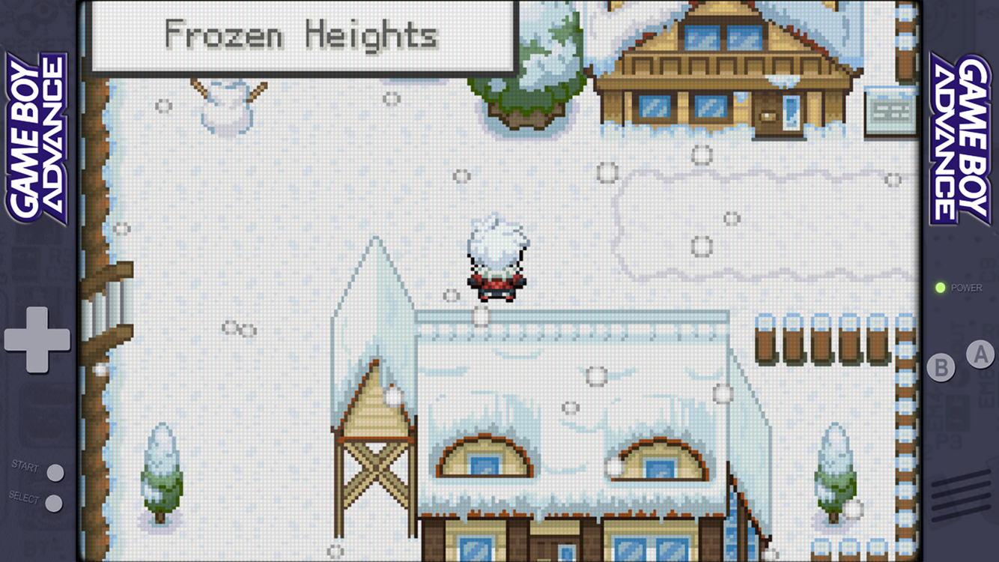

# Lo-Fi-Overlays
Unobtrusive, Lo-Fi overlays for 16:9 retro gaming handhelds, primarily for Retroid Pocket 4/Retroid Pocket 4 Pro. For use with RetroArch.  
Attribution: [Jeltr0n](https://github.com/Jeltr0n/Retro-Overlays), [cizia64](https://github.com/cizia64/CrossMix-OS)

## 16:9, 1334x750 resolution (Retroid Pocket 4/Pro) ##
### Game Boy Advance (GBA) ###
#### Default ####

#### Dark ####

#### Transparent Purple (See-through PCB) ####

