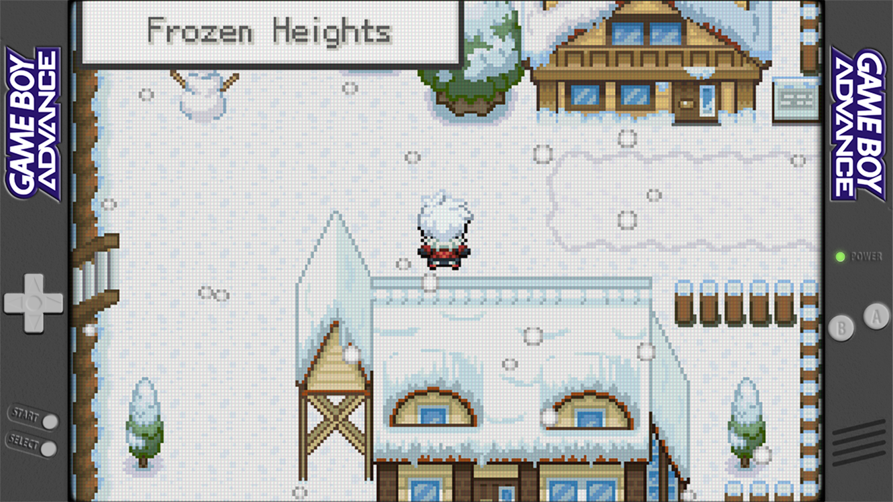
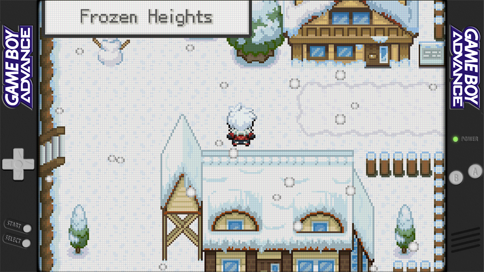
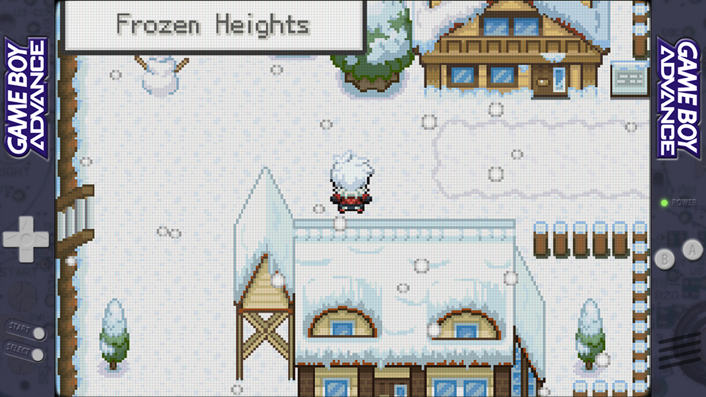

# Lo-Fi Overlays
Lo-Fi, unobtrusive overlays for 16:9 retro gaming handhelds such as, and tested on, Retroid Pocket 4/Retroid Pocket 4 Pro. It also includes pixel grid effect to better depict GBA display. Tested for 16:9, 1334x750 (750p) resolution. For use with RetroArch. This will probably work on any 16:9 device such as Odin 2 or the Retroid Pocket 5. However, I have neither so I cannot test it.  
  
Attributions: [Jeltr0n](https://github.com/Jeltr0n/Retro-Overlays), [cizia64](https://github.com/cizia64/CrossMix-OS)  

Apply using RetroArch Quick Menu
```
Quick Menu -> On-Screen Display -> Overlay Preset
Overlay Opacity 1.00
```
To set it permanent,
```
Quick Menu -> Overrides -> Save Game Overrides OR Save Content Directory Overrides.
```

### Game Boy Advance (GBA) ###
#### Default ####


#### Dark ####


#### Transparent Purple (See-through PCB) ####



